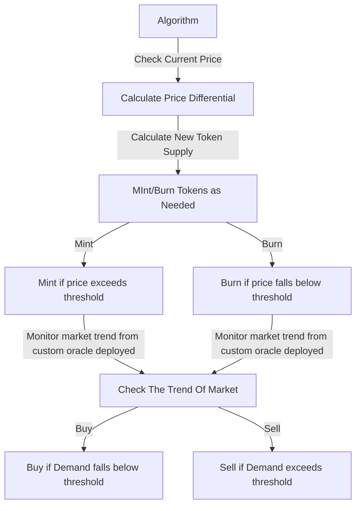

# Stablecoin By Abuzar Khan

<br> 
<div align="center">
  <h1>Stabilizing Algorithm </h1>
  </div>
  
  
 
<div align="center">
  <h1>Mint And Burn Mechanism  </h1>
  </div>
  
#### -The protocol mints (adds) or burns (removes) supply from circulation in proportion to the coin's price deviation from the $1 peg. If the coin price > $1, the protocol mints coins. If the coin price < $1, the protocol burns coins.

#### -Keeps the price of stable coin at targeted price and also checks every 24 hour for the volatility feature to automatically adjust the target price based on market conditions, such as the average price over a certain period or the price of a basket of other stablecoins. This can make the bot more adaptive to changing market dynamics and reduce the need for manual intervention.

<div align="center">
  <h1> Idea Behind The Bot </h1>
  </div>

#### The basic idea behind it is to adjust the supply of the stablecoin tokens to maintain a constant price in terms of the target asset. If the price of the stablecoin rises above the target price, the protocol will increase the supply of tokens by "minting" new tokens and distributing them to holders of the stablecoin. If the price of the stablecoin falls below the target price, the protocol will decrease the supply of tokens by "burning" existing tokens, effectively removing them from circulation.

#### The key advantage of using a this mechanism is that it allows the stablecoin to maintain its peg to the target asset without relying on centralized reserves of the target asset. Instead, the supply of the stablecoin is dynamically adjusted based on market conditions, which can help to prevent large fluctuations in price.

## Preventions against FlashLoans
  ### Using Time-Weighted Average Pricing (TWAP):
  #### We can create a Custom Price oracle Contract wich calculates average price over time. Instead of using the latest price, you can use the average price over a certain period. This helps mitigate flash loan attacks as the attacker would have to manipulate prices over a longer duration(by Buying or selling large number of tokens) 
  #### We used the aggregator contract price oracle because it provides a decentralized, tamper-resistant, and reliable source of price data. The aggregator contract receives periodic data updates from a decentralized oracle network, which consists of multiple oracles.

<div align="center">
  <h1> Flowchart </h1>
  </div>
  


# Steps To Run Tests Bot with following Command on cmd

## 1. Initialize localnet
    npx hardhat node
   
## 2. Run Tests
    npx hardhat test test/BotTest.js --network localhost   
## 3.Results
```diff
+4 passing
```


<br>
<br>


# Run Bot (in GATOCHAIN)
```diff
- @@ Make Sure Stablecoin have some USDT in them before initializing Bot AND owner account have USDT in its wallet @@

+ Configure Gatochain in hardhat config in networks
```
## 0. Function for mintAdjust and burnAdjust
Stablecoin should have a onlyOwner function for mintAdjust and burnAdjust which does not require any usdt to give or recieve when minting and burning so that it can adjust supply of stablecoin
## 1. Change Usdt And Stablecoin Smart Contract Addresses in The Bot File
 
## 2. Change OwnerAddress and its privateKey of smart Contract
```diff
- @@ Make Sure to put them in an .env file in production environmnet @@
```


## 3. Change RPC endpoint (Infura Alchemy etc)


## 4. Copy USDT and StableCoin ABIs in script/Abi Folders respectively

## 5. Run Bot VIA command prompt
    npx hardhat run scripts/Bot.js --network <networkName>
## 6. Change Schedule Timer as required (default to 1 minute)
#### node-cron expressions can be changed
    
    
